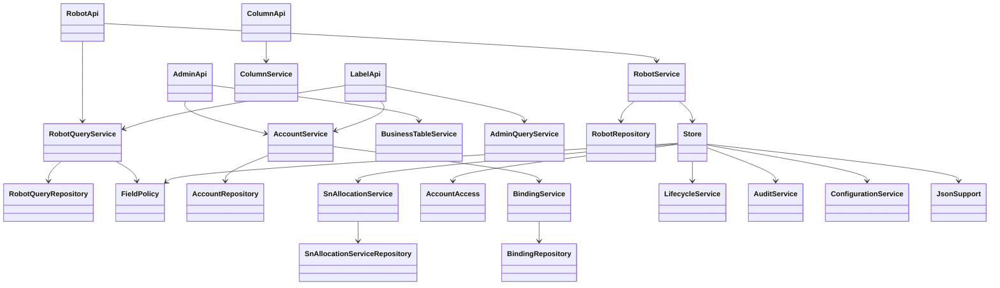
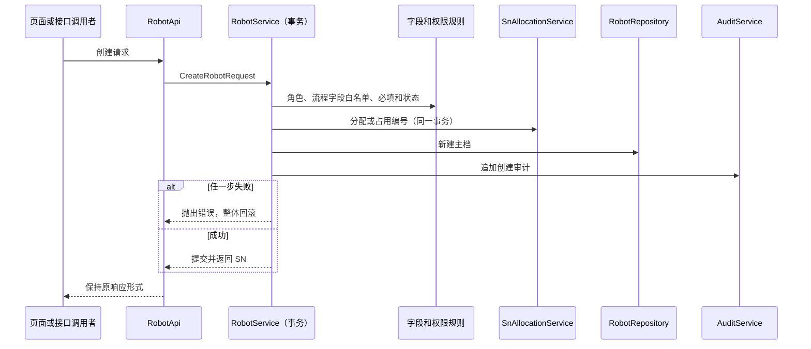

# Valenbot v2.2.0 架构与升级说明

## 本版改变了什么

本版保持 Java 17、Spring Boot 3.3.5、JDBC、PostgreSQL 和 Thymeleaf 工业工作台。集中处理课程规范第 6.1 节的职责边界，并修复其指出的创建规则与输入分类缺口。

| 层次 | 当前职责与入口 |
|---|---|
| HTTP | RobotApi、AdminApi、ColumnApi 接收请求并委托业务服务；WebController 返回页面；LabelApi 负责图像/文件响应，复用查询服务 |
| 完整业务用例 | RobotService、AccountService、AssemblyService、ProcessService、RepairService、SnService、FlashService、ColumnService、BusinessTableService、SettingsService |
| 查询与共享规则 | RobotQueryService、AdminQueryService；AccountAccess、FieldPolicy、ConfigurationService、AuditService、LifecycleService、SnAllocationService、JsonSupport |
| 数据访问 | 对应 Repository 持有 private final JdbcTemplate；只暴露固定 SQL 的具体操作，不向 Controller 开放任意 SQL 通道 |
| 兼容层 | Store 仅委托上述共享组件，保留旧调用接口；不再持有数据库连接或自行实现业务规则 |

构造器注入保留。未引入 JPA、微服务或为每个服务增加单实现接口。类暂时仍在 `com.robotsn` 包，职责通过类名及依赖表达；后续可以按领域拆包。

图示主要依赖，其他装拆、维修、流程等用例使用同一分层方式。Controller 不互相注入，数据访问不返回 HTTP ResponseEntity。

## 事务和授权

完整写用例在 Service 的公开方法声明 `@Transactional`。编号分配/占用、生命周期状态变化和绑定更新使用 `MANDATORY`，缺少上层事务时直接拒绝执行，防止部分提交。账号公共锁、机器人/安装记录行锁、revision 及唯一约束保留。

列表和 CSV 导出复用授权查询及字段投影：SQL 先按管理员、技术人员范围、普通用户 UUID 绑定筛选；旧 SN 范围仍解析到迁移后的机器人。字段定义和当前模组批量读取，不再逐个显示列发查询。权限没有在会话中长期缓存，重新绑定后下一次请求使用新范围。

本版保持三级权限及既有账号管理规则：普通用户只能改昵称，技术人员可新增/编辑但不能删除业务或修改字段结构，账号与绑定管理仅管理员可用。未绑定普通用户为零设备。

## 有意收紧的接口规则

- 新建主档使用明确的 CreateRobotRequest；未知顶层字段、错误的 fields 类型返回 400。动态字段继续使用 Map 并按字段定义验证。
- 新建自动设为“在库”，仅影响后续新建，不修改任何历史空值。状态展示列归档也不取消底层状态。
- 新建和编辑均禁止传入 qcResult、qcPerson、qcDate、qcReport、debugResult、debugPerson、debugDate、deliveryDate，即使值为空也不能通过主档路径写入；统一通过流程登记。表单同步排除这些输入。
- 流程的 date 必须显式填写合法 YYYY-MM-DD。页面预填今天供确认，补录应改为实际发生日期。流程字段不能设为主档必填；历史已有此配置时不阻止创建。系统登记时间另存，不再因缺 date 静默代用今天。
- maxSequence 必须为 1～9999 的 JSON 整数；字符串、布尔、小数、缺失、null 和越界均返回 400，且不能低于已分配的最大流水。模块数量也拒绝小数截断。
- CSV 每个单元格分别处理公式前缀、空白前缀、换行和引号，保留实际值的可读性。

已知的 v2.1 创建调用方若主动发送上述流程字段，需要调整请求。正常工作台已同步修改；历史 Bootstrap 来源导入仍保持原表事实，不补造质检通过记录。

## 数据库与发布升级

**v2.2.0 没有数据库结构变更，不新增 Flyway V3，也不改写已发布的 V1/V2。** 当前 schema 版本仍为 2。SQL 拆到 Repository 不意味着改表。

1. 保留原发布包和 JAR。先备份 `robot_sn_v2`，可用 tools/verify_upgrade.py 为原表原行记录只读指纹。
2. 停止确认属于本应用的 8082 实例，避免两个版本混用会话。不要停止 v1 或 PostgreSQL 服务。
3. 将新 `robot-sn-system-2.2.0.jar` 放入私有 `runtime/v2`；使用更新后的 Start-Valenbot.ps1 及原 config.json、credentials.xml。不重建数据库、不重导工作簿、不覆盖账号配置。
4. 启动后检查登录、版本显示、角色访问范围，并用只读指纹检查确认历史值保留。
5. 从 v2.1 升级到 v2.2 未改 schema，紧急回退可停止新版、用旧启动配置运行保留的 v2.1 JAR；这会重新暴露旧版的业务校验缺口。不要恢复旧备份覆盖升级后产生的新业务记录。若将来版本有迁移，必须重新制定回退方案。

v1 工程与 robot_sn 数据库、历史发布 ZIP 不参与本次升级。

## 可重复验证

普通 `mvn clean verify` 执行 32 项不依赖数据库的测试；2 项数据库事务测试仅在设置 `VALENBOT_TEST_ACK=robot_sn_v2_test` 后启用，且额外校验连接 URL 的库名。`mvn spotless:check` 检查 Java 格式。

完整验收使用全新、独立的 PostgreSQL 测试数据库或 schema：

1. 用 tests/synthetic_fixture.py 生成随机试用密码与合成台账到私有目录。
2. 显式设置 VALENBOT_DB_URL（必须 robot_sn_v2_test）、VALENBOT_DB_USER、VALENBOT_DB_PASSWORD、VALENBOT_BOOTSTRAP_FILE、VALENBOT_TEST_PRIVATE、VALENBOT_TEST_ACK 和 JAVA_HOME。
3. 执行 `mvn spotless:check clean verify`，共 34 项 JUnit，含直接调用服务的故障注入回滚测试。
4. 执行 `python tests/run_acceptance.py`，启动自有 8083 子进程，运行 v2.1 的 7 组与 v2.2 的 7 组 HTTP 验收，结束后仅停止自己创建的子进程。

测试运行器不删除数据库/schema；再次完整验收需准备新的空 schema 与匹配夹具，不能对上一次已变更的台账重复假设初始状态。合成工作簿用于可复现验证，不代替原 Excel 的业务保真证明；生产升级另做原值指纹对比。

GitHub Actions 使用临时 PostgreSQL 16 服务执行上述完整链路，仅上传 JAR 和测试报告，不上传合成账号文件，更不读取真实 runtime。

## 后续边界

本次未引入任意 Excel 网页导入、自动硬件 Flash、JPA、HTTPS 或开机服务。列表 API 仍兼容原数组返回，尚未切换为数据库分页；审计与其他大批量查询仍有进一步优化空间。创建已有固定 DTO，其他接口和部分仓储参数仍保留 Map/Object，后续可按用例逐步类型化。LabelApi 仍保留文件呈现代码，Store 兼容门面暂时保留；这不是所有代码完全领域化后的最终形态。
