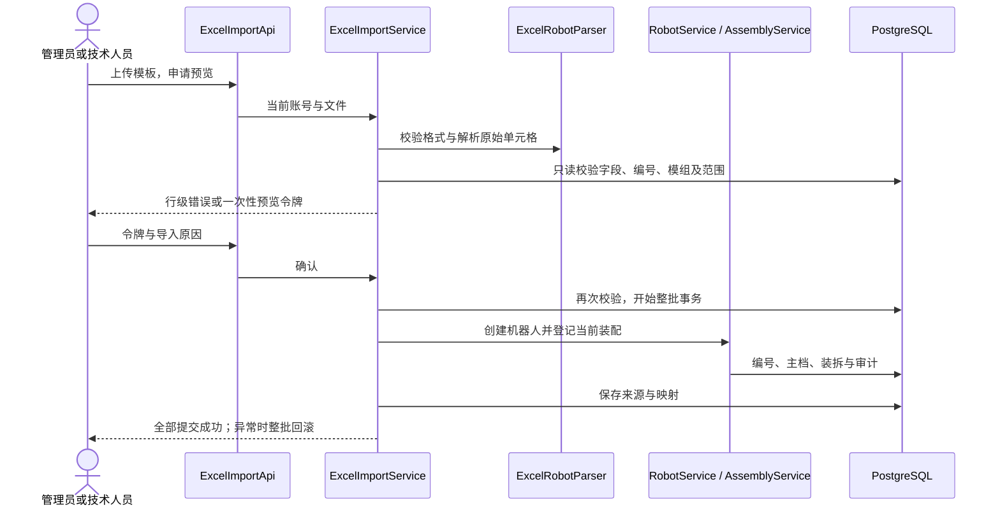

# Valenbot v2.3：Excel 新建机器人、权限收紧与 HTTPS

## 使用入口

管理员和技术人员在“机器人信息管理 → Excel 导入”或左侧“Excel 导入”进入。点击“下载 Excel 空白模板”，填写后选择文件，先“校验并预览”，核对每行内容、填写原因后“确认新建”。登录后模板接口为 `/api/import/robots/template`。

模板来自原《人形陪伴机器人 全生命周期信息管理表（客户可见 + 内部管控）》，保留 46 列、列顺序、分组和标题，第 4 行起为空白。新增“填写说明”，没有复制真实机器人、客户或 SN。原表分组文字不代替管理员配置的实际字段可见性。

- 仅 `.xlsx`，不接受改扩展名的 `.xls`、加密工作簿、宏、外部链接或公式。最多 2 MB、100 台机器人，最多 500 行；解压内容另有 20 MB 上限。
- 空白行跳过；版本未填写保持空白。第 3 行表头必须匹配；不支持任意字段映射或自定义列导入。
- SN 可留空，由网页所选年月和类型分配；可填写格式正确的新 SN 或已预留编号。有 SN 生成权限才能生成空 SN 或登记新编号；无该授权的技术人员须使用已预留编号。所有入口保留技术人员业务范围限制，受限于已有机器人的技术人员须联系管理员调整范围后才能新增。
- 已使用、作废、退役及重复 SN 拒绝；不覆盖、不追加修改现有机器人。指定的新 SN 会同步推进计数器，后续生成不会重复。
- 新建默认在库。M、AN:AS 灰色区域（交付、调试及质检字段）须留空，建档后通过流程登记；不能用导入绕过质检门禁。
- W:AI 保存对应硬件模组的当前安装关系，检查位置、数量和 SN 占用，追加装配历史；模板没有模组版本，保持空白。登记时间是本次提交时间，不能称为历史实际装配时间。
- AJ:AM 的装配、烧录人员及日期是主档字段，不会自动创建流程或硬件写入校验记录。
- 客户名称可保存到台账，但不会自动推断、创建或改变用户绑定。管理员仍在用户管理以稳定 ID 明确绑定。
- 新建必填规则继续生效。若管理员增加了模板不包含的必填自定义列，需要使用网页新建或调整必填规则，导入不会绕过它。

## 预览、提交和追溯

预览只读数据库，显示原行号、SN、完整填写内容和逐行错误；不占号、不建机器人。校验通过后产生绑定到提交账号的随机一次性令牌，有效期 10 分钟；每账号最多保留 3 次预览，进程重启会失效。

确认使用服务端预览内容，不能通过修改客户端参数替换机器人数据。再次检查账号、SN、字段、模组和当前权限。整批机器人、编号、计数器、装拆历史、来源及审计同事务提交，任一失败全部回滚。提交失败或令牌已使用后需重新预览，避免不确定的重复提交。

保存文件名、SHA256、原始非空单元格与坐标、46 列映射、原行号与最终 SN、操作者、提交时间和原因。自动 SN 在原文件中仍为空，生成结果单独记录，不篡改原始单元格事实。不保存原始上传二进制，管理员可导出来源快照；来源快照不能代替数据库备份。

## 权限变化

| 能力 | 管理员 | 技术人员 | 普通用户 |
|---|---|---|---|
| 下载模板、预览、确认新建 | 允许 | 允许，受 SN 授权及业务范围约束 | 禁止 |
| 导入来源及其导出 | 允许 | 禁止 | 禁止 |
| 审计日志及其导出 | 允许 | 禁止 | 禁止 |
| 登录日志 | 允许 | 禁止 | 禁止 |
| 机器人详情中的来源说明 | 允许 | 隐藏 | 隐藏 |

限制同时作用于导航、直接接口和导出。装拆、流程、维修等具体业务历史继续按原机器人范围可见；它们与系统级审计日志不同。

## HTTPS 部署

本机目标地址为 `https://192.168.110.8:8443/`，本机回环地址为 `https://localhost:8443/`。HTTP 8082 仅用于 GET/HEAD 跳转；HTTP 提交请求返回错误，不处理登录或业务写入。跳转目标取配置值，不采用访问者的 Host 请求头。会话 Cookie 为 Secure、HttpOnly，TLS 仅启用 1.2/1.3；二维码使用配置的 HTTPS 地址。

没有公共域名时使用本地 CA 签发服务器证书。**HTTPS 加密和设备信任证书是两件事**：服务器启用后传输加密，但每台客户端还需信任该 CA 才能正常无警告访问。不要把“忽略证书警告”作为部署方式。

本机私有 `runtime/v2/certs` 保存加密密钥和服务器 PKCS12；`tls-credentials.xml` 由运行账号的 Windows 凭据保护。只可向客户端分发 `root-ca.cer` 公钥证书，不能分发 `.p12`、CA 私钥、凭据或运行目录。更换 Windows 运行用户需要重新保存该用户的加密凭据。

Windows 客户端：双击根证书，安装到“当前用户 → 受信任的根证书颁发机构”，核对发送方提供的 SHA256 指纹。其他组织管理的设备应按组织证书策略安装。iPhone/iPad 安装描述文件后还需在证书信任设置启用完全信任；Android 按系统设置安装 CA，部分应用不信任用户 CA，应使用支持该证书配置的浏览器。证书不应通过不可信来源获取。

服务器证书有效期 365 天，CA 为 5 年。应在到期前更新服务器证书；IP 变化后重新签发包含新 IP 的证书并更新 publicUrl 和二维码。旧 8082 标签可经跳转继续使用；跨设备连通性取决于同一局域网与防火墙。当前没有自动续签或开机服务。

新服务器安装：按 README 建立 PostgreSQL 数据库及私有运行配置，再运行 `tools/create_lan_certificate.py 私有证书目录 局域网IP`（仅证书生成工具需要 Python + cryptography，Java 运行无需 Python）。该工具拒绝覆盖现有证书。将一次性密码通过 SecureString 存入 `tls-credentials.xml` 后删除明文密码文件。配置 `https: true`、`port: 8443`、`httpPort: 8082` 和正确的 `publicUrl`，将 JAR 放在 config.json 同目录后启动。若使用组织证书，则提供含私钥与证书链的 PKCS12 和配套密码即可。

## 升级、回退和边界

本版为 2.3.0，保留 2.2.0 及更早发布。不修改 Flyway V1/V2，无新表结构迁移，使用现有 source_import/source_sheet 保存批次。升级前备份数据库、配置与旧 JAR；确认旧进程身份后停止，再以新私有配置启动。原数据不重导、不覆盖。

回退需停止新版并恢复原 8082 HTTP 配置及 2.2.0 JAR。新增机器人数据仍保留，不能用旧备份直接覆盖它们；回退也会恢复旧版技术人员可查看来源和审计的权限，不符合本次收紧要求，只用于明确的紧急回退。

本版没有任意 Excel 映射、覆盖更新、历史质检/交付迁移或自动硬件 Flash。预览暂存在进程内，不支持多实例共享；当前单机局域网部署适用。
