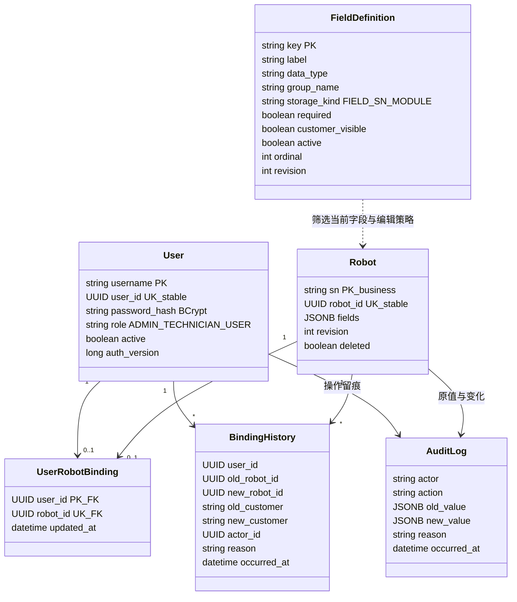
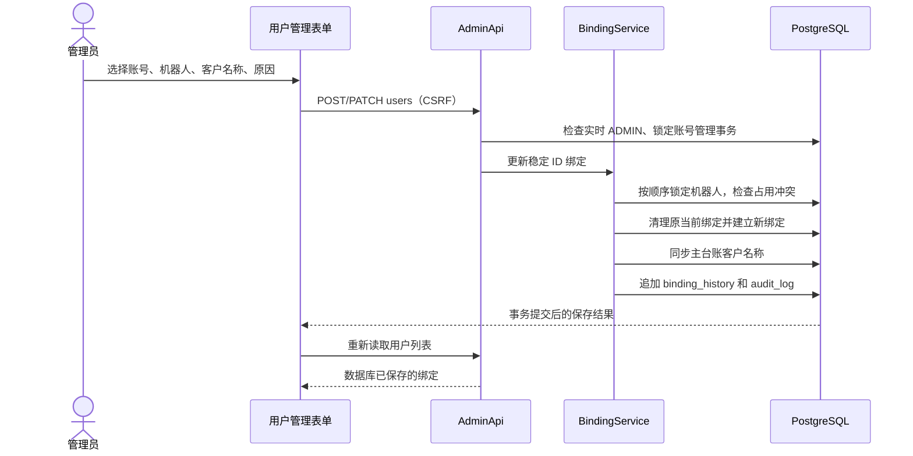
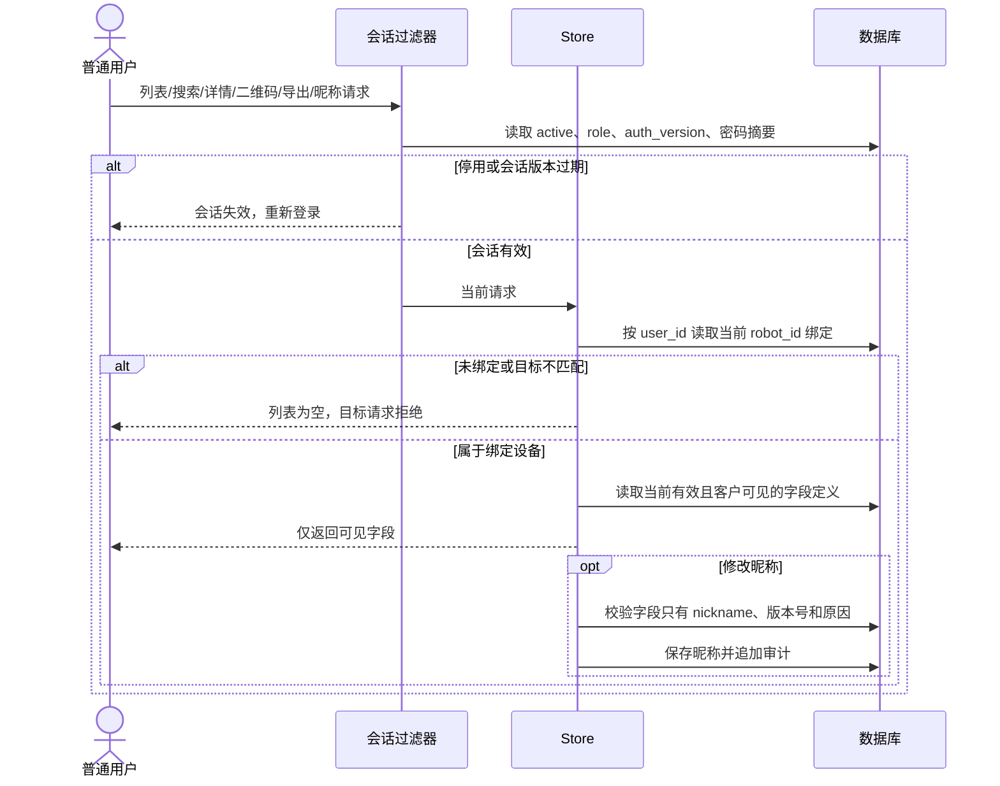
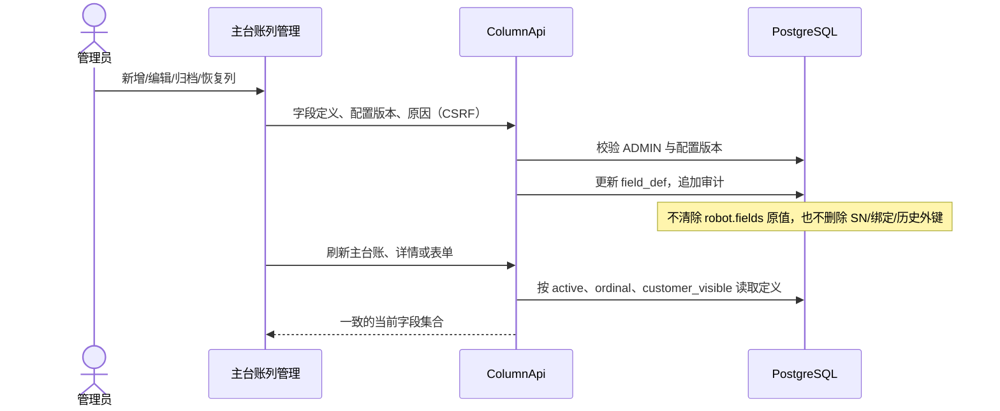
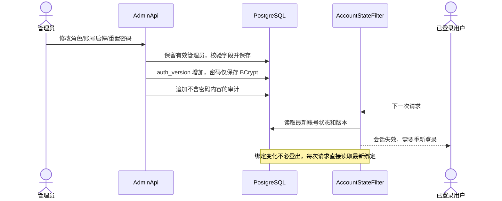

# Valenbot v2.2.0 实际权限与交互模型

以下描述当前代码和 V2 数据库迁移，不是尚未实现的目标模型。旧版 SN 主键与历史外键继续兼容，另外增加稳定 UUID 作为绑定关联键。

v2.2 已将完整业务迁入 Service、固定 SQL 迁入 Repository；以下图描述业务身份及权限交互。实际代码分层和新建事务时序见 [v2.2 架构与升级说明](v2.2-架构与升级说明.md)。流程字段由流程登记维护，流程日期必须明确填写。

## 类图

客户名称保存在 `robot.fields.customer`。它是可更改的展示值，不作为普通用户授权条件。SN 迁移时 `robot_id` 不变，因此绑定、旧二维码解析和装拆/维修历史可以同时保持。

## 管理员绑定时序

解绑清空原设备当前客户展示值，原客户和原绑定保留在历史。重新绑定不会给用户同时保留两台设备的权限。不同账号不能抢占同一机器人，需要管理员先明确解绑。

## 客户查询与昵称编辑时序

客户端参数、客户同名、改名、改 SN 或改网址都不能替代服务端绑定检查。昵称权限由固定业务规则校验，不从字段的“客户可见”标记推导写权限。

## 主台账列管理时序

## 账号状态和会话时序

页面在获得焦点及定时检查时刷新有效身份、绑定和字段配置。搜索发服务端请求。最终授权始终由后端执行；端口独立的会话 Cookie 避免 8082 与 8083 相互覆盖。

## 权限矩阵

| 功能 | 管理员 | 技术人员 | 普通用户 |
|---|---|---|---|
| 机器人列表、搜索、详情、二维码、导出 | 全部 | 技术业务范围 | 仅本人稳定绑定的一台；未绑定为零 |
| 查看主档字段 | 当前有效字段 | 当前有效字段 | 当前有效且客户可见字段 |
| 修改昵称 | 是 | 是 | 仅本人绑定设备 |
| 修改其他业务字段 | 是 | 是 | 否 |
| 新增机器人/补充业务记录 | 是 | 是；自动生成 SN 仍须专项授权 | 否 |
| 删除业务记录 | 是，归档 | 否 | 否 |
| 装拆、流程、维修、人工回读 | 是 | 是 | 否 |
| SN 生成、作废、迁移、替换 | 是 | 需专项授权 | 否 |
| 分配号段、修改编码规则 | 是 | 否 | 否 |
| 主台账列定义、归档、恢复 | 是 | 否 | 否 |
| 补充业务表和字段结构 | 是 | 否 | 否 |
| 用户、角色、启停、密码重置、绑定 | 是 | 否 | 否 |
| 审计/来源 | 全部 | 已有业务范围限制 | 否 |

原始 Excel 来源、旧字段值、历史空白、维修快照和 SN 唯一性约束不因增加绑定或列管理而被覆盖。
