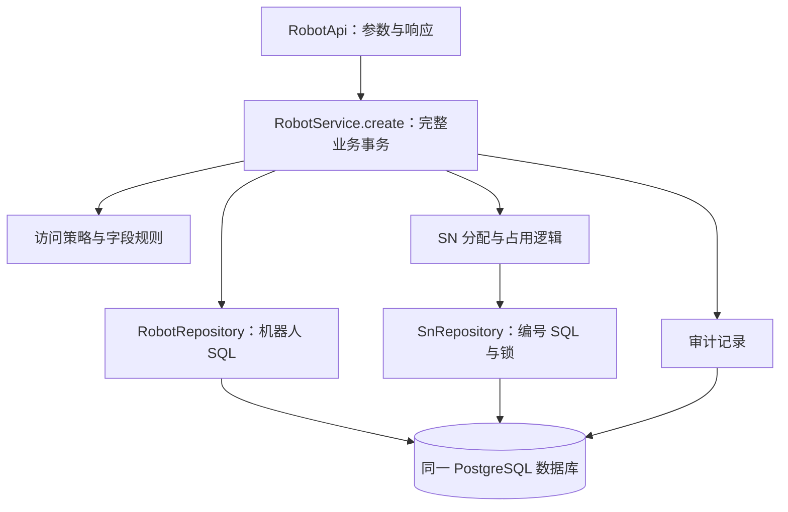

# Valenbot 代码分层专项评估：课程建议第 6.1 节

日期：2026-09-16。对象：`java-spring-v2` v2.1.0 当前源码。

本次只分析代码和依赖关系，没有修改业务实现、数据库或发布版本，没有重新执行接口验收。下文类名与方法名均以当前工作区为准；建议结构尚未实施。

## 一、结论

第 6.1 节的核心判断成立，建议作为渐进重构方向采用。

当前工程有 Spring Controller 和 Service，但尚未形成清晰的业务层与数据访问层：Controller 既接请求，又组织业务、执行 SQL 和审计；Store 则混合数据库工具、权限、业务规则和结果组装。Controller 还可以通过公开的 Store.db 绕过封装。

这会增加修改、复用和测试的成本，也容易让不同入口的规则不一致。它不等于当前系统无法运行、事务全部失效或已经发生数据泄露。没有使用 JPA 并不是问题；继续使用 JdbcTemplate 即可改善分层。

## 二、实际依赖结构

```mermaid
flowchart TD
    B[浏览器] --> W[WebController：页面路由]
    B --> R[RobotApi：机器人及多个业务流程]
    B --> A[AdminApi：用户、配置、审计、业务表]
    B --> C[ColumnApi：主台账字段管理]
    B --> L[LabelApi：标签及多种导出]
    L --> R
    L --> A
    A --> BS[BindingService]
    R --> S[Store：业务、权限、映射、数据库工具]
    A --> S
    C --> S
    L --> S
    BS --> S
    S --> DB[(PostgreSQL)]
    R -. 通过 Store.db 直接执行 SQL .-> DB
    A -. 通过 Store.db 直接执行 SQL .-> DB
    C -. 通过 Store.db 直接执行 SQL .-> DB
    L -. 通过 Store.db 直接执行 SQL .-> DB
```

这是所审业务类的主要关系，省略启动初始化和安全基础设施，并非完整应用类图。图中 Controller 之间的依赖是单向的，不能称为循环依赖。

## 三、逐项评估 6.1 的五个判断

### 1. RobotApi 同时管理多个领域：成立，优先整理业务用例

证据：`RobotApi.java` 第 29 行创建机器人、第 42 行装拆、第 49 行流程、第 56 行维修、第 58 行 SN 生成、第 62 行迁移、第 65 行 Flash 任务。

仅以创建方法为例，当前一个 HTTP 处理方法同时完成：

1. 校验技术角色和原因。
2. 根据是否传入 SN 决定自动分配，并检查专项权限。
3. 将编号从未使用改为已使用。
4. 验证动态字段、必填字段和初始状态。
5. 插入机器人、写审计、返回响应。

这些步骤共同构成“新建机器人”业务，应由一个服务入口组织并管理事务。Controller 保留参数接收、调用服务及响应构造即可。

影响已有具体例子：创建路径只对初始状态增加限制，编辑路径第 36 行另外禁止直接写入质检和调试结果。通用字段验证并没有表达“哪个业务动作可以写哪些字段”。这是当前规则分散的表现；抽类本身不会自动修好，仍要建立创建、编辑、流程各自的写入规则和测试。

不必首先把 RobotApi 拆成很多文件。先迁走完整用例，保留原 URL，再按机器人、SN、维修等职责拆控制器，更容易保持兼容。

### 2. AdminApi 兼管账号、配置、审计和业务表：成立，按角色聚合不等于业务聚合

证据：`AdminApi.java` 第 12 行新增账号、第 17 行修改账号、第 24 行查询审计、第 27 行设置、第 32 行起业务表管理。

这些功能碰巧部分由管理员操作，但变更原因不同。例如密码策略变化与补充表字段变化没有直接联系。类名还会误导阅读者：业务表读取和记录新增允许技术人员，实际权限取决于方法中的检查，而非 AdminApi 名称。

账号修改用例尤其应该整体抽取：有效管理员保护、角色与启停、密码、auth_version、绑定及审计需要同一事务。不能把它们机械拆成各自提交的 CRUD 操作，否则会产生“角色已改而绑定未改”等部分完成状态。

建议先抽取 AccountService；补充台账抽取 BusinessTableService；审计和来源查询有真实复用需求时再抽取查询服务。

### 3. Store 职责过多：成立，是最核心的结构问题

| 当前方法 | 实际承担的职责 |
|---|---|
| encode、decode、map | JSON 和数据转换 |
| actor、account、role | 当前身份和账号查询 |
| admin、technical、allowed、snAccess | 角色与数据范围授权 |
| one、公开 db | 通用 SQL 执行 |
| validateFields、requiredOnCreate | 动态字段规则 |
| robot、resolve | 机器人查询、别名解析、锁及授权 |
| visible | 字段可见性、输出组装及模块查询 |
| allocate、claim | 编号业务和数据库并发操作 |
| qcGuard、status | 质检门禁、生命周期变更、历史及审计 |
| audit、snapshot | 追溯记录及快照查询 |

其中 `visible()` 看起来是组装显示结果，实际上会读账号、字段定义和模组；`role()` 每次调用也会访问数据库。调用者很难仅凭名称判断成本和前置条件。

测试同样受影响：想单独验证字段规则，需要模拟字段查询；想验证状态规则，又牵涉账号、数据库、JSON 和审计。可以测试，但依赖准备复杂，测试容易与内部 SQL 细节绑定。

不建议只把 Store 改名为 CommonService，也不建议把所有方法平移成一个巨大 RobotService。应按已经迁移的用例逐步提取编号服务、字段规则、访问策略和专用查询/仓储；未迁移部分暂时留在 Store，迁完再删除。

### 4. public final JdbcTemplate db：判断成立，但问题是封装而非线程安全

证据：`Store.java` 第 13 行；API 中大量 `s.db.queryForList()`、`s.db.update()`。

`final` 只表示不能更换该引用，不阻止调用者任意执行查询或更新。Store 因此既像服务，又像向所有调用者提供数据库访问的入口。

这使应用很难强制约定：机器人查询是否排除归档、是否解析旧 SN、是否限制客户范围、更新后是否写历史。当前不少路径已经正确执行这些步骤，但新的路径仍需程序员自行记住。

将 db 改成 private 后，再公开 `getDb()` 或 `executeSql(String sql)`，不能解决这个问题。仓储应提供具体的数据操作，如查找机器人、锁定机器人、保存字段、占用未使用编号，而不是继续向上层暴露任意 SQL。

Repository 是内部数据访问组件，不应直接对外暴露。访问策略由业务/查询服务统一应用；需要按权限分页的 SQL 可以接收明确的授权范围条件，避免取出全量数据后才筛选。

### 5. LabelApi 调用其他 Controller：成立，应迁移到共享查询服务

证据：`LabelApi.java` 第 16～17 行注入 RobotApi、AdminApi；第 27 行调用 `admin.users()`、`admin.sources()`、`admin.tableData()`、`robots.sns()` 和 `robots.detail()` 等。

这是复用现有代码的捷径，但导出被绑定到 HTTP 处理方法的返回结构。如果用户列表将来返回分页包装，导出可能跟着改变；如果详情增加仅供页面使用的数据，导出也可能不经意增加内容。

需要准确说明：这类调用是 Java 方法调用，不是再次发 HTTP 请求；被调用方法体里的 `s.admin()`、`s.technical()` 等检查仍执行。因此不能据此认定当前 users 导出绕过管理员权限。也不能笼统宣称所有 Spring 代理拦截都会失效。准确的问题是将 HTTP 端点当成内部可复用业务接口，混淆调用契约。

更合理的关系是“机器人页面 API”和“导出 API”共同调用 RobotQueryService；账号、来源等查询分别复用其服务。页面可分页，导出可遍历全部授权结果，但设备范围和字段规则必须一致。

PNG 绘制、二维码生成、CSV 转义可提取为普通渲染工具，不必全部变成带 Service 注解的类。

## 四、6.1 应补充的边界

- **WebController 已较清晰。** 它只返回页面或空图标响应，无须为了统一样式强制增加一个服务层。
- **ColumnApi 也有同类问题。** 文件短不代表职责少，当前仍包含字段规则、锁、SQL 和审计，后续应迁往字段管理服务。
- **BindingService 是已有的正确方向，但尚未完整分层。** 它封装了独立业务概念，仍通过 Store 执行 SQL；权限、账号锁和事务前提来自 AdminApi。迁移时不能仅给 BindingService 添加事务就认为所有前提均已解决。
- **服务层仍依赖 HTTP 错误语义。** Store.fail() 抛 ResponseStatusException。未来需要独立业务调用时可改用明确业务异常，由 ApiErrors 转为 HTTP 响应；不必与第一轮抽取同时全面替换。
- **大量 Map 让层间契约模糊。** 固定身份和业务参数可以用 record/DTO，动态字段继续保留 Map 并验证。把同一个任意 Map 从 Controller 传到 Service 再传到 Repository，只增加层数而未改善边界。
- **已有构造器注入应保留。** 不需要改成字段注入，不需要每个服务都配一个只有单一实现的接口，也不需要按每张表强行建立 Service。

## 五、适合本项目的渐进目标

以“创建机器人”为第一条链路：



这是职责示意，不要求第一轮为每个框新建一个类。关键是权限、编号占用、主档和审计属于同一业务提交；Repository 不应自行开启相互独立的新事务。

推荐实施顺序：

1. 为创建路径建立严格业务回归，再修正已知字段规则。把行为修复与纯代码搬迁分开提交，便于评审。
2. 抽取创建服务和机器人、SN 的必要仓储方法，保留原接口、JSON、HTTP 错误语义与数据库结构。
3. 抽取共享查询服务，解除 LabelApi 对其他 Controller 的依赖。对齐列表、详情、旧 SN、扫码和导出的授权语义。
4. 逐步迁移账号与绑定、装拆、维修、字段和补充表，减少 Store。每次只迁移一组完整用例。
5. 稳定后再优化分页与批量查询、拆包和统一格式。无需修改既有 Flyway V1/V2，也无需切换 JPA。

## 六、如何判断重构确实有效

不能只看类文件是否变多。对已迁移范围，至少满足：

- Controller 不执行 SQL，不调用其他 Controller。
- 服务用例能在不构造 HTTP 请求的情况下测试，仍有明确的操作者与授权约束。
- Repository 不返回 ResponseEntity、不读取 HTTP 请求，也不提供通用 SQL 通道给 Controller。
- 完整动作由明确事务入口管理；故意让审计或占号后的后续步骤失败，验证没有部分提交。
- 客户 UUID 绑定、昵称写入白名单、逻辑删除、旧 SN 解析、字段可见性、revision 和锁约束保持。
- 同一账号重绑定或修改权限后，下一次请求采用新范围；不能为了减少查询把旧权限长期缓存。
- 普通用户直接接口与导出隔离、技术人员不能删除或改表结构等既有验收继续通过。

因此，第 6.1 节方向正确，适合采用；实施重点应是**集中完整业务规则、明确数据访问入口、共享授权查询**。机械拆文件、增加注解或换 ORM 都不能代替这些目标。
